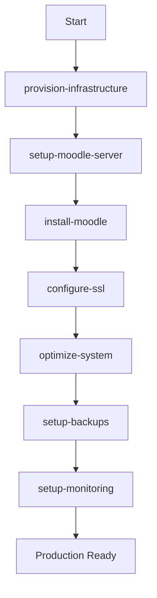
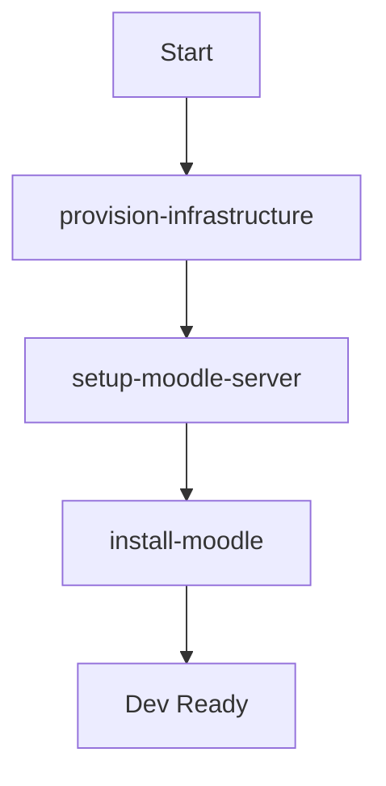
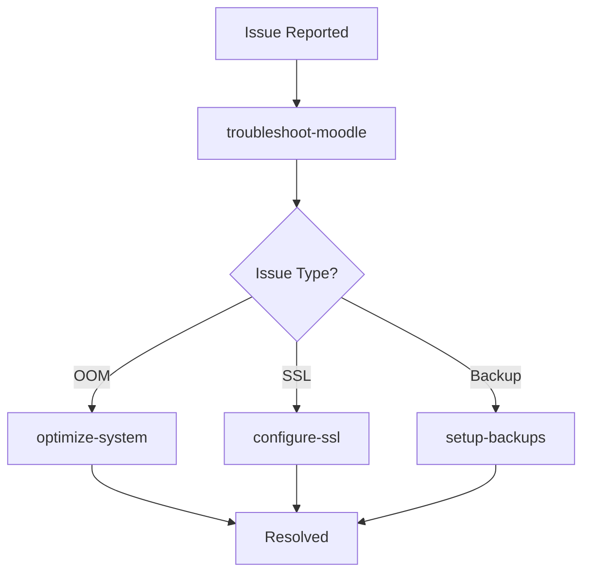

# Moodle 5.1 AWS Deployment Skills

Professional skills for AI agents (Claude Code, ChatGPT, etc.) to autonomously deploy and manage Moodle 5.1 on AWS infrastructure.

## Overview

This collection of skills enables AI agents to:
- Provision AWS infrastructure (EC2, RDS, Security Groups, EBS)
- Install and configure LAMP stack on Amazon Linux 2023
- Deploy Moodle 5.1 from official sources
- Configure SSL/HTTPS with Let's Encrypt
- Optimize system performance for t4g instances
- Set up automated backups with S3
- Configure comprehensive CloudWatch monitoring
- Troubleshoot common Moodle operational issues

## What are Skills?

Skills are structured instruction sets that guide AI agents through complex technical tasks. Each skill provides:
- **Context**: What the skill does and when to use it
- **Prerequisites**: Required conditions before execution
- **Instructions**: Step-by-step implementation guidance
- **Automation**: Links to scripts for faster execution
- **Examples**: Real-world usage scenarios
- **Troubleshooting**: Common issues and solutions

## Available Skills

### 1. Infrastructure Provisioning
**File:** [`provision-infrastructure.md`](provision-infrastructure.md)

Provisions complete AWS infrastructure using Terraform:
- EC2 instances (t4g ARM Graviton series)
- RDS MariaDB database
- Security Groups with proper rules
- EBS volumes for data storage
- Elastic IP for static addressing
- IAM roles for CloudWatch and S3

**Use when:** Starting a new Moodle deployment from scratch

**Prerequisites:** AWS account, credentials configured, SSH key pair

### 2. Server Setup
**File:** [`setup-moodle-server.md`](setup-moodle-server.md)

Installs and configures LAMP stack:
- Apache 2.4 with MPM Event
- PHP 8.4 with required extensions
- MariaDB client tools
- Firewall configuration
- SELinux policies for Moodle

**Use when:** Infrastructure is provisioned and EC2 instance is ready

**Prerequisites:** Clean Amazon Linux 2023 instance

### 3. Moodle Installation
**File:** [`install-moodle.md`](install-moodle.md)

Downloads and installs Moodle 5.1:
- Downloads from official GitHub repository
- Creates and secures config.php
- Runs CLI installer for database setup
- Configures cron for scheduled tasks
- Creates initial admin user

**Use when:** Server is configured and RDS database is available

**Prerequisites:** LAMP stack installed, database endpoint available

### 4. SSL Configuration
**File:** [`configure-ssl.md`](configure-ssl.md)

Configures HTTPS with Let's Encrypt:
- Obtains free SSL/TLS certificate
- Configures Apache for HTTPS
- Implements A+ security headers
- Sets up automatic renewal
- Redirects HTTP to HTTPS

**Use when:** Moodle is installed and domain points to server

**Prerequisites:** Domain name, DNS configured, ports 80/443 open

### 5. System Optimization
**File:** [`optimize-system.md`](optimize-system.md)

Optimizes server for production use:
- Auto-calculates PHP-FPM settings based on RAM
- Configures SWAP for memory safety
- Tunes Apache MPM settings
- Sets up memory monitoring
- Optimizes Moodle cache

**Use when:** After installation or when experiencing performance issues

**Prerequisites:** Moodle installed and running

**Based on:** Real-world ACG project optimization experience

### 6. Backup Setup
**File:** [`setup-backups.md`](setup-backups.md)

Configures automated backup system:
- Daily database backups
- Weekly moodledata backups
- Configuration file backups
- S3 offsite storage (3-2-1 strategy)
- Automatic retention management

**Use when:** Production deployment is ready

**Prerequisites:** S3 bucket created, IAM permissions configured

### 7. Monitoring Setup
**File:** [`setup-monitoring.md`](setup-monitoring.md)

Configures CloudWatch monitoring:
- Custom metrics (CPU, memory, disk)
- Log aggregation (Apache, PHP-FPM, Moodle)
- Proactive alarms with email notifications
- Health check scripts
- CloudWatch dashboard

**Use when:** Production deployment needs visibility and alerting

**Prerequisites:** CloudWatch access, SNS topic for alerts

### 8. Troubleshooting
**File:** [`troubleshoot-moodle.md`](troubleshoot-moodle.md)

Diagnoses and resolves common issues:
- Service unavailable (503) errors
- Database connection failures
- Out of memory (OOM) problems
- Performance degradation
- SSL certificate issues
- Backup failures

**Use when:** Issues are reported or site is not functioning properly

**Prerequisites:** Access to server and logs

## How to Use These Skills

### With Claude Code (CLI)

1. **Copy skills to your project:**
   ```bash
   cp -r deploy-moodle/skills ~/.claude/skills/moodle/
   ```

2. **Reference skills in conversation:**
   ```
   You: "Deploy Moodle 5.1 on AWS for me"

   Claude: [Uses provision-infrastructure skill]
           [Uses setup-moodle-server skill]
           [Uses install-moodle skill]
           [Uses configure-ssl skill]
   ```

3. **Skills work together autonomously:**
   - Claude reads skill instructions
   - Executes steps or automation scripts
   - Handles errors and troubleshooting
   - Proceeds to next skill in workflow

### With ChatGPT or Other AI Assistants

1. **Upload skill files to conversation**
2. **Reference specific skill:**
   ```
   "Follow the instructions in setup-backups.md to configure backups"
   ```

3. **Or describe goal and let AI choose:**
   ```
   "My Moodle site is showing 503 errors, please fix it"
   → AI will use troubleshoot-moodle.md skill
   ```

### Manual Use (Human Operators)

Skills also serve as comprehensive documentation for human operators:
1. Read skill file for the task at hand
2. Follow step-by-step instructions
3. Use automation scripts when available
4. Refer to troubleshooting sections as needed

## Typical Deployment Workflow

### Full Production Deployment



**Estimated time:** 45-60 minutes (mostly automated)

**AI Agent prompt:**
```
"Deploy production Moodle 5.1 on AWS with SSL, backups, and monitoring.
Domain: moodle.example.com
Instance: t4g.medium
Database: RDS MariaDB"
```

### Quick Development Deployment



**Estimated time:** 20-30 minutes

### Troubleshooting Existing Deployment



## Automation Scripts

Each skill references automation scripts in [`../scripts/`](../scripts/):

| Skill | Script | Time |
|-------|--------|------|
| provision-infrastructure | `01-provision-infrastructure.sh` | 10-15 min |
| setup-moodle-server | `02-setup-server.sh` | 5-8 min |
| install-moodle | `03-install-moodle.sh` | 10-15 min |
| configure-ssl | `04-configure-ssl.sh` | 3-5 min |
| optimize-system | `05-optimize-system.sh` | 2-3 min |
| setup-backups | `06-setup-backups.sh` | 2-3 min |
| setup-monitoring | `07-setup-monitoring.sh` | 5-8 min |

**Using scripts with AI:**
```
You: "Use the automation script to install Moodle"

Claude: [Reads install-moodle.md skill]
        [Executes script 03-install-moodle.sh]
        [Verifies installation success]
        [Reports results]
```

## Prerequisites

### AWS Account Setup

- Active AWS account
- IAM user with permissions:
  - EC2: Full access
  - RDS: Full access
  - VPC: Full access
  - CloudWatch: Full access
  - S3: Create buckets, write objects
- AWS CLI configured with credentials
- EC2 SSH key pair created

### Local Requirements

- Terraform 1.5+ (for infrastructure provisioning)
- AWS CLI 2.x
- SSH client
- Domain name (for SSL)
- Email address (for SSL and alerts)

### Cost Considerations

Estimated monthly costs for typical deployment:

| Component | Specification | Cost/month |
|-----------|--------------|------------|
| EC2 (t4g.medium) | 4 GB RAM, 2 vCPU | ~$24 |
| RDS (db.t4g.micro) | MariaDB | ~$15 |
| EBS (gp3) | 100 GB | ~$8 |
| S3 (backups) | ~200 GB | ~$5 |
| CloudWatch | Metrics + Logs | ~$10 |
| Data Transfer | 100 GB/month | ~$9 |
| **Total** | | **~$71/month** |

## Architecture

```
┌─────────────────────────────────────────────────────────┐
│                     AWS Cloud                            │
│  ┌───────────────────────────────────────────────────┐  │
│  │                VPC (10.0.0.0/16)                  │  │
│  │                                                   │  │
│  │  ┌─────────────────┐      ┌──────────────────┐  │  │
│  │  │  Public Subnet  │      │  Private Subnet  │  │  │
│  │  │                 │      │                  │  │  │
│  │  │  ┌──────────┐   │      │  ┌────────────┐ │  │  │
│  │  │  │   EC2    │   │      │  │    RDS     │ │  │  │
│  │  │  │ t4g.med  │◄──┼──────┼─►│  MariaDB   │ │  │  │
│  │  │  │          │   │      │  │ db.t4g.mic │ │  │  │
│  │  │  │  Moodle  │   │      │  └────────────┘ │  │  │
│  │  │  └────┬─────┘   │      │                  │  │  │
│  │  │       │         │      └──────────────────┘  │  │
│  │  │       │         │                            │  │
│  │  └───────┼─────────┘                            │  │
│  │          │                                      │  │
│  └──────────┼──────────────────────────────────────┘  │
│             │                                          │
│  ┌──────────▼───────────┐    ┌─────────────────────┐ │
│  │    Elastic IP        │    │   CloudWatch        │ │
│  │  (Static address)    │    │  (Monitoring)       │ │
│  └──────────────────────┘    └─────────────────────┘ │
│                                                        │
│  ┌──────────────────────┐    ┌─────────────────────┐ │
│  │     S3 Bucket        │    │     Route 53        │ │
│  │   (Backups 3-2-1)    │    │  (DNS optional)     │ │
│  └──────────────────────┘    └─────────────────────┘ │
└────────────────────────────────────────────────────────┘
```

## Real-World Experience

These skills are based on actual deployment and optimization of the **ACG Calidad** project:

### Challenge Faced
After Blue-Green deployment Go-Live, production site went down with 503 errors due to Out of Memory (OOM) killer terminating PHP-FPM.

### Root Cause
PHP-FPM misconfiguration:
- `pm.max_children = 50` (designed for 8GB+ RAM)
- Server: t4g.medium with 4GB RAM
- Each PHP process: ~200MB
- Total potential: 50 × 200MB = 10GB (exceeds available RAM)

### Solution Implemented
1. **Immediate:** Restarted PHP-FPM, enabled auto-start
2. **Short-term:** Configured 2GB SWAP for safety net
3. **Long-term:** Optimized PHP-FPM (`max_children = 15`)
4. **Monitoring:** Hourly memory checks with logging

### Results
- Site stability: 99.9%+ uptime since optimization
- Memory usage: Stable at 40-60%
- No OOM kills in 3+ months
- Response time: < 2 seconds avg

This real-world experience is incorporated into the `optimize-system.md` skill and automated in the `05-optimize-system.sh` script.

## Skill Design Philosophy

### 1. **Automation-First**
Every skill references automation scripts. AI agents prefer scripts over manual steps for speed and reliability.

### 2. **Context-Aware**
Skills include prerequisite checks and explain *why* each step is necessary, enabling AI to make informed decisions.

### 3. **Error-Resilient**
Comprehensive troubleshooting sections help AI agents recover from failures autonomously.

### 4. **Production-Ready**
Based on real deployments, not theoretical configurations. Includes security best practices, monitoring, and backups.

### 5. **Cost-Conscious**
Includes cost estimates and optimization guidance to help users make informed infrastructure decisions.

### 6. **Modular**
Each skill is independent but works seamlessly with others. Deploy only what you need.

## Common AI Agent Prompts

### Full Deployment
```
"Deploy production Moodle 5.1 on AWS t4g.medium with RDS MariaDB,
SSL, backups to S3, and CloudWatch monitoring. Domain: moodle.example.com"
```

### Troubleshooting
```
"My Moodle site is showing 503 Service Unavailable errors.
Please diagnose and fix the issue."
```

### Optimization
```
"My Moodle site is slow with 4GB RAM. Optimize PHP-FPM and
system settings for better performance."
```

### Backup Recovery
```
"I need to restore yesterday's database backup from S3.
Walk me through the recovery process."
```

### Infrastructure Scaling
```
"Users are complaining about slowness. Should I scale vertically
or optimize the current t4g.medium instance?"
```

## Troubleshooting Skills Usage

### AI Agent Not Following Skill
**Problem:** Agent ignoring skill instructions

**Solutions:**
1. Upload skill file directly to conversation
2. Reference skill explicitly: "Use the install-moodle skill"
3. Copy skill content into prompt if needed

### Script Execution Failures
**Problem:** Automation script failing

**Solutions:**
1. AI should automatically check logs
2. Skill includes troubleshooting section
3. Manual steps available as fallback

### Missing Prerequisites
**Problem:** Skill can't proceed due to missing dependencies

**Solutions:**
1. Skills check prerequisites before proceeding
2. AI should execute prerequisite skills first
3. Clear error messages guide next steps

## Contributing

These skills are open for improvement. Consider:
- Adding new skills for specific scenarios
- Updating based on Moodle version changes
- Incorporating AWS service updates
- Sharing optimization insights

## Version History

- **v1.0** (2026-02): Initial release
  - 8 comprehensive skills
  - Based on ACG Calidad project
  - Tested with Claude Code and ChatGPT
  - Full automation scripts included

## License

These skills are provided as-is for educational and production use. Customize as needed for your environment.

## Support

For issues or questions:
1. Check skill troubleshooting sections
2. Review Moodle documentation: https://docs.moodle.org
3. Consult AWS documentation: https://docs.aws.amazon.com
4. Moodle community forums: https://moodle.org/forums/

## Related Resources

- **Scripts:** [`../scripts/`](../scripts/) - Automation scripts
- **Terraform:** [`../terraform/`](../terraform/) - Infrastructure as Code
- **Documentation:** [`../docs/`](../docs/) - Technical guides
- **Main README:** [`../README.md`](../README.md) - Project overview

---

**Ready to deploy Moodle 5.1 on AWS?** Start with [provision-infrastructure.md](provision-infrastructure.md) or ask your AI agent:

```
"Deploy production Moodle 5.1 following the skills in deploy-moodle/skills/"
```
